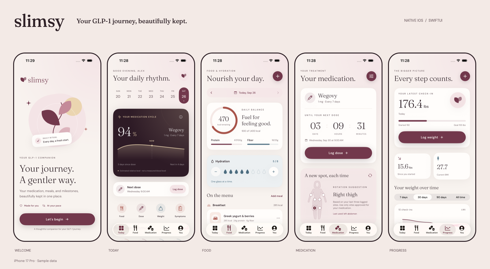

# Slimsy for iPhone

A native SwiftUI implementation of the existing Slimsy app, with a refreshed visual design, the complete original onboarding, and the same tracking workflows. See [the feature parity audit](FEATURE_PARITY.md).



## Open and run

Open `Slimsy.xcodeproj` in Xcode and run the **Slimsy** scheme on an iPhone simulator. The checked-in project is ready to open; XcodeGen is only needed after adding files or changing `project.yml`.

- Deployment target: **iOS 17.0+**.
- Built with **Xcode 26.3 / Swift 6.2.4**, in Swift 5 language mode.
- The Adapty iOS SDK is pinned through Swift Package Manager. No CocoaPods, JavaScript runtime, or Metro server is needed.
- For a physical iPhone, select your signing team in the app and widget targets first. Both share the App Group `group.com.fastshotai.slimsy` (`group.com.fastshotai.slimsy.native` in Debug), which feeds the Home Screen widget; enable it for your team.
- Debug bundle ID: `com.fastshotai.slimsy.native`, so it can coexist with the Expo app.
- Release bundle ID: `com.fastshotai.slimsy`, matching the original app for an in-place upgrade.

From this directory:

```sh
xcodebuild -project Slimsy.xcodeproj -scheme Slimsy \
  -configuration Debug \
  -destination 'platform=iOS Simulator,name=iPhone 17 Pro,OS=26.3' \
  -derivedDataPath build build
```

Simulator builds are signed locally without a team, which the widget's App Group requires; an unsigned (`CODE_SIGNING_ALLOWED=NO`) build stops at launch because it cannot open the App Group.

After adding Swift files or changing target settings:

```sh
xcodegen generate
```

## Feature coverage

| Existing workflow | Native implementation |
| --- | --- |
| Onboarding profile, medication, delivery, dose, frequency, device, height, weights, start date, activity, weekly pace, motivation, cravings, concerns, consent, optional first dose | All 28 original stages, including insights, support, rating, GLP-1 preview, and Pro |
| Dashboard and quick logging | Today tab, week selector, medication estimate, nutrition goals, activity, and weight preview |
| Food photo analysis and manual food entry | Camera/library with native crop and automatic analysis, the same Fastshot/Newell API, editable estimates, all nutrition fields, persistent photos, meal editing and deletion |
| Water tracking | Daily totals, add/remove controls, and editable goal |
| Medication logging and countdown | Native date/time input, custom schedules, dose history, and precise countdown |
| Injection-site rotation | Interactive front-view diagram and six site choices; rotation avoids the last three sites |
| Side effects | Nine symptom types, severity 1–5, notes, history, and simultaneous logging with a dose |
| Weight tracking | Canonical pounds, metric/imperial display, 7/30/90-day/all-time charts, chart selection, goals, BMI, notes, and deletion |
| Profile, targets, preferences, legal links, app review, reset | You tab with native controls, StoreKit review request, and confirmation before reset |
| CSV export | Native share sheet with profile, targets, and all log types |
| Restore purchases / Pro plans | Existing Adapty placement and premium access level; native StoreKit prices, offers, purchase, and restoration |

Custom intervals now affect the estimate, next-dose countdown, and notifications. Calendar dates use the device's local day, avoiding the original UTC day-boundary problem. Historical weigh-ins and deletion consistently recalculate the latest weight. The medication-level formula is ported from `utils/pharmacokinetics.ts` and checked against values generated by the original implementation.

The original onboarding “Start Free Trial” action only completed onboarding; it did not execute a purchase. The native Pro stage reads the existing Adapty placement and uses actual localized App Store prices and eligible introductory offers when available. When plans are unavailable, setup can still continue to the journal, without claiming a subscription or trial.

## Photo-analysis configuration

The supplied Fastshot project is configured locally in the ignored file `Configuration/Secrets.xcconfig`. The native URLSession client has been verified against the live service with a public sample food image.

For another checkout, copy `Configuration/Secrets.xcconfig.example` to `Configuration/Secrets.xcconfig`, then set:

```xcconfig
NEWELL_API_URL = https:/$()/newell.fastshot.ai
FASTSHOT_PROJECT_ID = your-fastshot-project-id
```

`/$()/` preserves the double slash in xcconfig syntax. These map to the original `EXPO_PUBLIC_NEWELL_API_URL` and `EXPO_PUBLIC_PROJECT_ID`; the Expo EAS project ID is a different value.

The client sends a multipart JPEG to `/v1/analyze/image/upload`, matching `@fastshot/ai` 1.0.8. After choosing/capturing and cropping a photo, analysis starts automatically, matching the original flow. The picker entry screen explains the upload. Results stay editable, with retry and manual-entry controls. Requests are cancellable; errors leave manual entry available. Camera access is requested after tapping the camera, and the library picker opens only after choosing Photo library.

## Subscriptions

The supplied Adapty public SDK key and `default` placement are configured locally in `Configuration/Secrets.xcconfig`:

```xcconfig
ADAPTY_PUBLIC_SDK_KEY = your-adapty-public-sdk-key
ADAPTY_PLACEMENT_ID = default
```

These map to `EXPO_PUBLIC_ADAPTY_API_KEY` and `EXPO_PUBLIC_ADAPTY_PLACEMENT_ID`. The native app fetches products from the existing placement, purchases through Adapty, and restores the same `premium` access level. Native StoreKit supplies localized prices and introductory-offer eligibility. Adapty's profile delegate updates access when a purchase or restore changes it. IDFA and IP-address collection are disabled.

Alternatively, a checkout without Adapty can use direct StoreKit with `SLIMSY_MONTHLY_PRODUCT_ID` and `SLIMSY_YEARLY_PRODUCT_ID`. Real purchase/restore verification needs the owner's Apple sandbox or device account and is not performed automatically. UI test and sample-data launches never activate the live billing SDK.

[Adapty installation](https://adapty.io/docs/sdk-installation-ios) and [restore-purchase API](https://adapty.io/docs/restore-purchase) are the integration references. The dependency is pinned to 3.15.7, matching the original app's SDK family.

The live placement check succeeded and returned `monthly` and `yearly`. App Store product loading returned `noProductIDsFound` in the unsigned simulator build. Verify prices, purchase, and restoration with the original Release bundle ID and the owner's Apple sandbox/device account before distributing the app.

## Persistence and moving existing data

The app stores a versioned, Codable JSON journal in Application Support and photos in its own Photos subdirectory. Writes are atomic and use iOS file protection. A failed write does not commit in-memory state, and unreadable existing records are never silently replaced.

For an in-place **Release** upgrade using the original bundle ID, the app reads the existing `slimsy-storage` entry from AsyncStorage's manifest/MD5 file format and copies available local meal photos into persistent storage. It leaves the original AsyncStorage files untouched. This requires retaining the app's sandbox during the upgrade; uninstalling the original app first removes its data.

For a separate installation, including the Debug build:

1. In the Expo app, choose **Settings → Data & Privacy → Save Backup for Native iOS**.
2. Save the JSON file to Files.
3. Complete setup in the native app, then choose **You → Restore a backup** and select that file.
4. Review the record counts and confirm replacement.

Native backups contain all records, profile fields, targets, preferences, and available photos. The importer also understands raw Expo/Zustand `slimsy-storage` JSON. Raw Zustand data alone cannot carry files from another app's sandbox; use the backup action to include photos. Missing/expired Expo cache photos are reported without dropping their meal records.

## Validation

```sh
xcodebuild -project Slimsy.xcodeproj -scheme Slimsy \
  -destination 'platform=iOS Simulator,name=iPhone 17 Pro,OS=26.3' \
  -derivedDataPath build -parallel-testing-enabled NO \
  CODE_SIGNING_ALLOWED=NO test
```

Tests cover persistence/relaunch, chronological weights, unit conversions, local midnight, invalid input, custom schedules, PK parity with the TypeScript implementation, atomic dose/symptom saves, nutrition parsing and HTTP failures, CSV escaping, backup compatibility, and legacy AsyncStorage migration. UI tests walk all 28 onboarding stages, both injection and pill branches, dose logging/skipping, metric and imperial inputs, all five tabs, logging sheets, nutrition totals, water changes, and unit switching.

The live API check is opt-in because it makes a real request using a public sample image:

```sh
TEST_RUNNER_SLIMSY_LIVE_AI_TEST=1 xcodebuild \
  -project Slimsy.xcodeproj -scheme Slimsy \
  -destination 'platform=iOS Simulator,name=iPhone 17 Pro,OS=26.3' \
  -derivedDataPath build \
  -only-testing:SlimsyTests/NutritionTests/testLiveFoodEstimateWhenExplicitlyEnabled \
  CODE_SIGNING_ALLOWED=NO test
```

A separate read-only Adapty placement check is also available:

```sh
TEST_RUNNER_SLIMSY_LIVE_BILLING_TEST=1 xcodebuild \
  -project Slimsy.xcodeproj -scheme Slimsy \
  -destination 'platform=iOS Simulator,name=iPhone 17 Pro,OS=26.3' \
  -derivedDataPath build \
  -only-testing:SlimsyTests/OnboardingTests/testLiveAdaptyPlacementWhenExplicitlyEnabled \
  CODE_SIGNING_ALLOWED=NO test
```

This checks activation, profile access, and product IDs from the placement; it makes no purchase.

`TEST_RUNNER_SLIMSY_LIVE_STORE_PRODUCTS_TEST=1` additionally requests the real App Store products. This requires a working store environment; the current unsigned simulator returns no products.

The photo UI test is opt-in separately: import the [public salad fixture](https://images.unsplash.com/photo-1512621776951-a57141f2eefd?w=800&q=80) into a test simulator with `xcrun simctl addmedia`. Pass `TEST_RUNNER_SLIMSY_LIVE_PHOTO_UI_TEST=1` and `TEST_RUNNER_SLIMSY_PHOTO_FIXTURE_LABEL` containing that image's observed Photos accessibility-label prefix, then run `SlimsyUITests/SlimsyUITests/testPublicPhotoCanBeCroppedAndIsAnalyzedAutomatically`. It requires a unique matching image, opens native crop controls, verifies automatic analysis, and saves the meal. It never chooses an arbitrary library image during default tests.

The crop → live estimate → save flow has passed using that public fixture. Screenshots are in `Preview/18-food-photo-crop.png` and `Preview/19-food-photo-estimate.png`.

Debug launch arguments:

- `--demo-data`: sample journey in memory, with no changes to the real journal or notification schedule.
- `--onboarding`: fresh, in-memory onboarding preview.
- `--ui-testing`: isolated empty state for onboarding tests.
- `--ui-persistence`: a separate test journal; `--reset-test-store` resets only that journal.
- `--dark-mode` and `--large-type`: appearance and accessibility previews, without changing iPhone settings.

These launch modes are compiled out of Release builds. Screenshots in `Preview` use explicitly selected sample data.

## Design assets and references

Fraunces and DM Sans are bundled under the SIL Open Font License; licenses are in `Slimsy/Resources/Fonts`. The leaf mark, injection diagram, and app icon are code-drawn. Regenerate the app icon with `swift Scripts/generate-assets.swift "$PWD"`.

The raccoon companion was generated with **GPT Image 2.5 Sunburst** and is bundled as transparent, independently animated head, eyelid, arm, body, and tail layers. It appears on welcome, Today, and the first-dose confirmation. Tap to greet it; Reduce Motion uses a matching still. See the [mascot artwork, exact prompts, and animation API](Design/Mascot/README.md). Rebuild its image sets with `python3 Scripts/prepare-mascot.py` (requires Pillow). Debug-only `--mascot-reduce-motion` previews the still without changing system settings.

Platform references: [SwiftUI tab navigation](https://developer.apple.com/documentation/swiftui/tabview), [Swift Charts selection](https://developer.apple.com/documentation/swiftui/view/chartxselection(value:)), [notification authorization](https://developer.apple.com/documentation/usernotifications/asking-permission-to-use-notifications), and [Expo's File API](https://docs.expo.dev/versions/v54.0.0/sdk/filesystem/).
